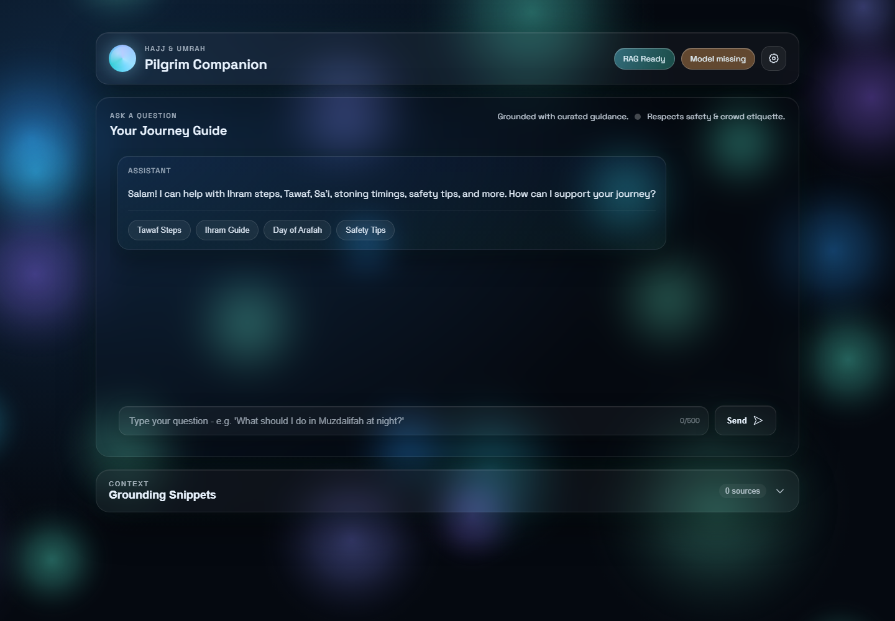
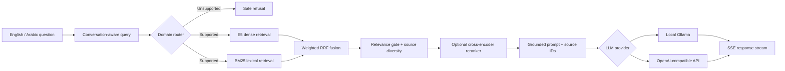

<div align="center">

# Pilgrim Companion

### Evidence-grounded AI guidance for Hajj and Umrah

[](https://github.com/fahaddubush/pilgrim-companion/actions/workflows/ci.yml)
[](https://www.python.org/)
[](https://fastapi.tiangolo.com/)
[](#choose-an-llm-provider)
[](LICENSE)

**Hybrid multilingual retrieval · grounded citations · local-first privacy · streaming glass UI**

</div>



## Overview

Pilgrim Companion is a portfolio-grade Retrieval-Augmented Generation application for Hajj and
Umrah questions. It retrieves evidence from a curated multilingual knowledge base, rejects unrelated
questions, and asks the selected language model to answer only from cited context.

The project is intentionally local-first: it can run entirely on a laptop through Ollama, or connect
to any provider implementing the OpenAI-compatible chat-completions API.

> [!IMPORTANT]
> This application provides general educational guidance, not a religious ruling. Pilgrims should
> consult qualified scholars and current Ministry of Hajj and Umrah or Nusuk guidance.

## Measured results

| Metric | Result | Why it matters |
|---|---:|---|
| Retrieval Recall@4 | **100%** | A relevant passage appeared in the top four results |
| Mean Reciprocal Rank | **0.926** | Relevant evidence usually ranked first |
| Out-of-domain rejection | **100%** | Unrelated benchmark questions were refused |
| Median retrieval latency | **51.8 ms** | Fast enough for interactive streaming |
| Knowledge-base quality | **123 unique chunks** | 62 exact duplicates removed |

Results come from the bundled 12-question English/Arabic regression set on a CPU development
machine. They validate pipeline regressions, not religious correctness or production accuracy. See
[`evaluation/latest_results.json`](evaluation/latest_results.json) and expand the benchmark before
making broader claims.

## Architecture



### Why this RAG design?

- **Dense + lexical retrieval** handles semantic questions, Arabic queries, ritual names, and exact
  transliterations better than either method alone.
- **Reciprocal Rank Fusion** combines rankings without assuming incomparable BM25 and cosine scores
  share a scale.
- **Corrective relevance gating** prevents the generator from treating an unrelated nearest neighbor
  as evidence.
- **Source diversity** reduces repetitive adjacent chunks and increases evidence coverage.
- **Optional reranking** provides a higher-accuracy mode while keeping the default CPU-friendly.
- **Conversation-safe caching** caches standalone questions only, avoiding incorrect follow-up reuse.

The design analysis, current RAG research, rejected alternatives, and freshness strategy are in
[`docs/RAG_DESIGN.md`](docs/RAG_DESIGN.md).

## Feature highlights

| Retrieval & grounding | Application engineering | Experience |
|---|---|---|
| Multilingual E5 embeddings | Typed FastAPI contracts | Token-by-token SSE streaming |
| FAISS cosine search | Lifespan-managed services | Responsive liquid-glass interface |
| BM25 + weighted RRF | Local or API-based LLM | Source URLs and score inspection |
| Arabic normalization | Bounded, thread-safe caches | English/Arabic safe refusals |
| Domain routing | Explicit degraded health state | Copy, retry, and quick prompts |
| Optional cross-encoder | XSS-safe content rendering | Accessibility fallbacks |

## Choose an LLM provider

Use the small settings button in the application header to switch between **Local Ollama** and an
**API** without restarting the server. API credentials entered in the modal stay only in the current
browser tab's memory: they are not placed in local storage, cached by the RAG layer, logged, or
returned by the backend.

For a server-wide default, copy `.env.example` to `.env` and select one provider there. Secrets in
`.env` are ignored by Git.

### Option A — fully local with Ollama

```env
LLM_PROVIDER=ollama
OLLAMA_MODEL=llama3.2:3b
OLLAMA_BASE_URL=http://localhost:11434
```

```bash
ollama pull llama3.2:3b
ollama serve
```

This mode keeps prompts and answers on the local machine and has no per-request API cost.

### Option B — OpenAI-compatible API

```env
LLM_PROVIDER=api
API_MODEL=your-model-name
API_BASE_URL=https://your-provider.example/v1
API_KEY=your-secret-key
```

This works with services exposing the standard `/chat/completions` streaming format. The API key is
read from the environment or the in-app modal and is never returned by the application or written to
logs. Use HTTPS whenever the application is accessed beyond localhost.

## Quick start

```bash
git clone https://github.com/fahaddubush/pilgrim-companion.git
cd pilgrim-companion

python -m venv .venv
```

Activate the environment and install dependencies:

```bash
# Windows PowerShell
.\.venv\Scripts\Activate.ps1

# macOS / Linux
source .venv/bin/activate

pip install -r requirements.txt
cp .env.example .env
python main.py
```

Open `http://localhost:8000`.

## API surface

| Method | Endpoint | Description |
|---|---|---|
| `GET` | `/` | Chat interface |
| `GET` | `/health` | Retrieval and LLM readiness/provider |
| `GET` | `/api/stats` | Knowledge-base and cache statistics |
| `POST` | `/api/chat` | Complete JSON answer |
| `POST` | `/api/chat/stream` | Server-Sent Events answer stream |
| `POST` | `/api/warmup` | Pre-warm the configured provider |

<details>
<summary><strong>Example request</strong></summary>

```bash
curl -X POST http://localhost:8000/api/chat \
  -H "Content-Type: application/json" \
  -d '{"message":"What are the steps of Tawaf?","history":[]}'
```

The response includes `reply`, grounded `contexts`, retrieval `confidence`, and `llm_model`.

</details>

## Quality and evaluation

```bash
pip install -r requirements-dev.txt
pytest -q
python scripts/audit_kb.py
python scripts/evaluate_retrieval.py
```

Rebuild the FAISS index after a reviewed change to `chunks.json`:

```bash
python scripts/build_index.py
```

Knowledge updates should retain the source URL, retrieval timestamp, content hash, and reviewer. For
this safety-sensitive domain, reviewed official-source ingestion is preferred over uncontrolled live
web retrieval.

## Repository structure

```text
app/                 Hybrid retrieval and LLM provider clients
data/kb/             Deduplicated chunks, metadata, and FAISS index
docs/                RAG architecture and UI notes
evaluation/          English/Arabic retrieval regression set
scripts/             Index build, audit, and evaluation commands
static/              Safe chat client and WebGL visual system
templates/           Main interface
tests/               Fast regression tests
config.py            Typed environment configuration
main.py              FastAPI lifecycle, API, and SSE orchestration
```

## Roadmap

- Scholar-reviewed expansion of the Arabic evaluation set
- Allow-listed Ministry/Nusuk freshness pipeline with staleness indicators
- Evidence-level answer faithfulness evaluation
- Benchmark-driven comparison of E5-small and BGE-M3
- Container image and deployment profile

## Author

Built by **[fahaddubush](https://github.com/fahaddubush)** as an applied AI engineering project
covering retrieval, evaluation, backend architecture, model-provider abstraction, streaming UX, and
responsible domain constraints.

Contributions are welcome through issues and pull requests. See [`CONTRIBUTING.md`](CONTRIBUTING.md)
and [`SECURITY.md`](SECURITY.md).

## License

Released under the [MIT License](LICENSE).
